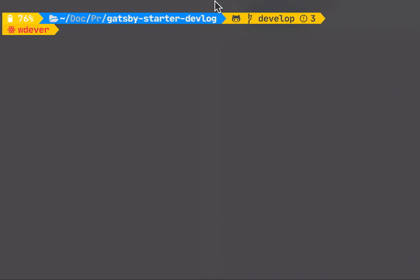

# Gatsby-starter-devlog

개발자 블로그를 위한 gatsby starter

## 예시

[예시](https://gatsby-starter-devlog.vercel.app/)

[사용 사례](USECASE.md)

> 이 스타터를 사용하셨다면 이슈를 통해 알려주세요.

## 핵심 기능

- 그리드 뷰 🌈
- 코드 하이라이트 (Atom one dark + JetBrains Mono) ✨
- Utterances를 이용한 댓글 💬
- Buy me a coffee를 이용한 기부 ☕️💸
- Google Analytics 📊
- 다크 모드 지원 !!! 🌗

## Getting Start

1. Gatsby 앱 생성

```sh
yarn gatsby new my-blog https://github.com/WDever/gatsby-starter-devlog

혹은

npx gatsby new my-blog https://github.com/WDever/gatsby-starter-devlog
```

2. 개발 서버 시작

```sh
yarn develop

혹은

npm run develop
```

3. 포스트 생성

`content/articles`에 **cli!!!** 를 이용하여 포스트를 생성해보세요.



4. 포스트 작성

GitHub Flavor Markdown 문법으로 포스트를 작성 하실 수 있습니다.

또한 썸네일 이미지를 추가하실 수도 있습니다. 만약 썸네일 이미지가 필요 없으시다면 자동으로 생성된 `image` 메타데이터를 삭제해주세요.

5. Vercel로 배포

Vercel로 배포 해보세요!

[](https://vercel.com/import/project?template=https://github.com/WDever/gatsby-starter-develog)

## 구조

### root

```sh
/root
├── .eslintrc.json // eslint 설정 파일
├── .prettierrc // prettier 설정 파일
├── gatsby-browser.js // 폰트, 코드 하이라이트 스타일링
├── gatsby-config.js // Gatsby 설정 & 메타데이터
└── gatsby-node.js // Gatsby 관련 함수 파일들
```

### src

```sh
src
├── components // 스타일링과 로직이 포함된 컴포넌트들
├── hooks // 유용한 Hook들
├── lib // 폰트 & 타입스크립트로 재작성된 Gatsby 파일들
├── pages // 포스트를 제외한 라우팅
├── templates
│   ├── blog-post.tsx
│   └── home.tsx

├── types // graphql-codegen로 생성된 타입들
└── utils
    ├── functions // 유용한 함수들
    └── hooks //
```

### content

```sh
content
├── about // 작성자에 대해서 / 이력서
│   └── index.md
│
├── articles //  포스트들
│   ├── my-first-post-example // 이 디렉토리의 이름이 곧 url이 됩니다.
│       └── index.md // index.md 외의 사진과 같은 것들을 넣어두시면 됩니다.
│
├── assets
    ├── profile-pic // BIO에서 사용될 프로필 사진
    └── wdever-icon // 탭에서 보여질 아이콘
```

## 커스터마이즈

### 탭 아이콘

`assets/wdever-icon` 를 본인만의 고유한 아이콘으로 변경한 후 `gatsby-plugin-manifest` 에서 경로를 수정해주세요. 해당 설정은 `gatsby-config.js`에 있습니다.

### Profile Image

`assets/profile-pic` 를 본인만의 프로필사진으로 변경해보세요.

### Utterances

블로그 프로젝트를 올린 저장소의 이름 (유저 이름 / 저장소 이름 형식) 을 `gatsby-config.js/siteMetadata.repo` 에 입력해주세요.

### Google Analytics

본인의 trackingId를 `gatsby-config.js/gatsby-plugin-google-analytics.options.trackingId` 에 추가해주세요.

## 문제 해결

### Field "image" must not have a selection since type "String" has no subfields

어떤 포스트에서 `image` 메타데이터가 제대로 설정 되지 않았습니다. 잘못된 경로 혹은 잘못된 파일 이름일 수 있습니다. 썸네일이 필요 없다면 `image` 메타데이터를 삭제해주세요.

### localStorage is not defined

아직 이 이슈의 이유를 제대로 모릅니다. 그저 빌드할 때에 localStorage가 없어서 생기는 오류라고 추측중입니다. 하지만 모두 잘 작동하니 걱정하지 마세요.

## 기여

많은 분들의 기여를 언제나 기다리고 있습니다. 함께 개선해주세요!

감사합니다.
