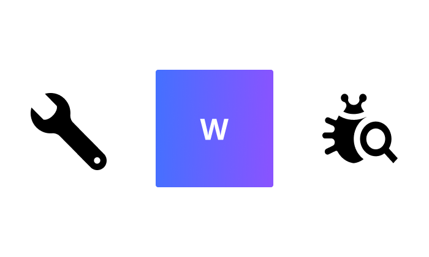
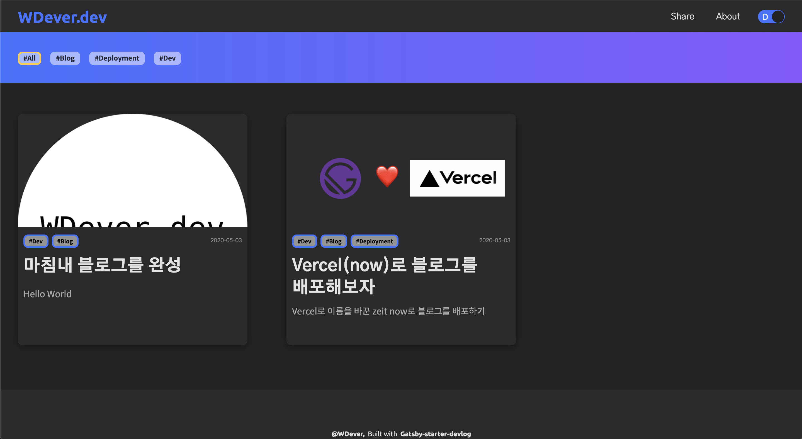
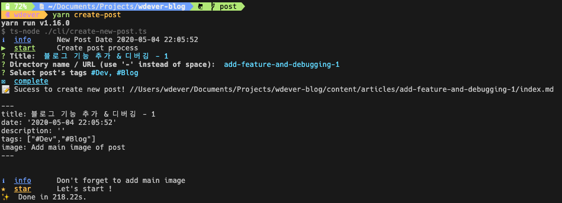

# 블로그 첫 기능 업데이트와 버그 수정

어제 블로그를 배포하고, 연달아 글을 두 개 쓰고 난 후, 눈에 보이는 버그 몇 개를 잡았습니다. 또한 있으면 좋겠다 생각한 기능을 개발 하였습니다.

## 버그 수정

### 1. 포스트 순서 버그

내 블로그 글의 올바른 순서는

1. [마침내 블로그를 완성](https://wdever.dev/complete-a-blog-at-last/)
2. [Vercel(now)로 블로그를 배포해보자](https://wdever.dev/deploy-with-vercel/)

이다. 어제 두 번째 글을 작성한 후 확인차 배포된 블로그를 확인 해보니 글의 순서가 이상한 것을 알게 됐다. 글을 작성한 순서가 위와 같기 때문에 나중에 쓴 글인 Vercel(now)로 블로그를 배포해보자가 앞에 있어야 하는데 다음과 같이 순서가 반대인 것이다.



문제는 포스트의 날짜 설정이 너무 간단한 데에 있었다.

원래 말 그대로 날짜만 frontmatter에 넣어줬다.

```md
---
title: 마침내 블로그를 완성
date: '2020-05-03'
description: 'Hello World'
tags: ['#Dev', '#Blog']
image: ./simple-wdever-dev.png
---

---

title: Vercel(now)로 블로그를 배포해보자
date: '2020-05-03'
description: 'Vercel로 이름을 바꾼 zeit now로 블로그를 배포하기'
tags: ['#Dev', '#Blog', '#Deployment']
image: ./gatsbywvercel.png

---
```

이렇게 날짜만 넣어줘도 잘 정렬이 될 거라 생각했지만, 이는 코드를 제대로 보지 않은 것이었다.

`Gatsby`에서는 `GraphQL`을 이용해 데이터를 다루는데, 포스트의 순서는 `GraphQL`로 포스트들의 데이터를 가져올 때 정렬을 해주며 정해진다.

```typescript
export const pageQuery = graphql`
  query BlogIndexQuery {
    site {
      siteMetadata {
        title
      }
    }
    allMarkdownRemark(sort: { fields: [frontmatter___date], order: DESC }) {
      edges {
        node {
          excerpt(pruneLength: 100)
          fields {
            slug
          }
          frontmatter {
            date(formatString: "YYYY-MM-DD")
            title
            description
            tags
            image {
              childImageSharp {
                fluid(maxWidth: 700) {
                  ...GatsbyImageSharpFluid
                }
              }
            }
          }
        }
      }
    }
  }
`;
```

이것이 포스트의 데이터를 가져오는 쿼리문이다. `allMarkdownRemark(sort: { fields: [frontmatter___date], order: DESC })`이 부분이 frontmatter의 date를 이용해 포스트의 순서를 정렬하는 부분인데, 날짜가 같아서 순서를 재배열 할 수 없었고, 결국 디렉토리 순서대로 나오게 된 것이라 추정한다.

그래서 각 포스트의 frontmatter에 시간을 입력함으로써 해결했다.

```md
date: '2020-05-03 05:48'

date: '2020-05-03 07:07'
```

### 2. 이전 / 다음 포스트 레이아웃

이 글이 올라가기 전 까지는 내 블로그에 글이 단 두개다. 그래서 이전 / 다음 포스트에도 버튼이 각각 하나씩 밖에 렌더링 되지 않는데, 이 상황에서 문제가 발생했다.

처음 올린 포스트에 들어가면 다음 포스트로 가는 버튼이 있다. 의도대로라면 오른쪽에 붙어있어야 하지만 사진처럼 왼쪽에 붙어있는 버그가 있었다.


이 버그는 해당 레이아웃을 감싸를 Wrapper에 `justify-content: space-between`속성을 주었기 때문에 생겼다. 다음과 같이 `styled-components`의 props를 활용하여 해결했다.

```tyepscript
// nav/index.tsx

if (previous === null) {
  return (
    <Wrapper onlyNext>
      <NavItemComponent data={next} isNext />
    </Wrapper>
  );
}

// nav/style.tsx

justify-content: ${({ onlyNext }): string =>
  onlyNext ? 'flex-end' : 'space-between'};

```

### 3. Home 최소 높이

지금은 집에서 개발을 하고 있어 27인치 모니터와 13인치 맥북을 사용하여 개발한다. 상대적으로 화면이 작은 맥북에서는 문제가 없어보였지만 상대적으로 화면이 큰 27인치에서는 다음과 같은 문제가 발생했다.


이는 간단하게 해결할 수 있었다. 사실 개발 할 때 이 문제를 발견하여 `min-height`와 calc를 이용하여 방지하려 했지만 `min-height` 속성이 엉뚱한 컴포넌트에 들어가서 발생한 문제였다. min-height를 정확한 컴포넌트로 옮겨 해결했다.

## 신기능

### 1. 포스트 생성 CLI

[한재엽님의 gatsby-starter-bee](https://github.com/JaeYeopHan/gatsby-starter-bee)는 cli를 통해 포스트의 메타데이터를 입력받아 포스트를 생성해주는 기능이 있다. 고작 포스트를 두개 작성했지만 이 매번 frontmatter를 작성하는데 귀찮음을 느껴 개발하게 되었다.

그동안 node.js를 이용하여 cli를 개발해 본 적은 없었기 때문에 신선한 경험이었다. 한재엽님의 코드를 상당 부분 참고하였다.



입력은 [`inquirer`](https://github.com/SBoudrias/Inquirer.js/) , 출력은 [`signale`](https://github.com/klaussinani/signale) 을 이용했다. 한재엽님의 코드가 이해하기 쉬워서 비교적 쉽게 만들었다.

다만 그럼에도 어려웠던 부분이 있었는데, 내 블로그는 Tag 기능이 있다. Tag는 여러개를 선택할 수 있고, 추가 역시 가능하게 해야했다.

Tag를 선택하고 추가하는 기능을 만드는 것은 어렵지 않았지만 Tag를 포함해 모든 메타데이터를 `gray-matter` 를 사용하여 String 형태로 만들어 마크다운 파일에 작성 해줘야 했다. 여기서 Tag가 문제를 일으켰다.

원래는 배열의 형태로 입력하면 될 것이라 생각했지만 전혀 그렇지 않았다. 문자열의 배열을 파라미터로 넣어주면 다음과 같이 frontmatter를 생성하였다.

```md
---
tags: - #Dev
- #Test
---
```

frontmatter은 `YAML` 문법인 것으로 아는데 아무래도 `YAML` 에 맞게 변환된 것으로 보인다.

이를 해결하기위해 배열을 넣어주지 말고, `JSON.stringify()`를 이용하여 문자열로 변환해서 넣어주니 이번에는 다음과 같이 생성되었다.

```md
---
tags: '["#Dev", "#Test"]'
---
```

문제가 없어 보일 수 있지만 사실 문제다. tags는 그냥 배열이어야 한다. 다음처럼.

```md
---
tags: ['#Dev', '#Test']
---
```

저 작은 따옴표를 지우는데 고생을 했다. 처음에는 왜 작은 따옴표가 붙는지 실험했고, 반점과 같은 문자가 들어가면 작은 따옴표로 문자열을 감싸준다는 것을 발견했다.

작은 따옴표를 처음부터 생성되지 않게 하는 것은 불가능하다 생각해 결국 정규표현식과 `String.replace()` 함수를 이용해 해결했다.

```typescript
const createFrontMatter = (contents: IFrontMatter): string => {
  const frontMatterArr = matter.stringify('', contents).split('\n');

  frontMatterArr[4] = frontMatterArr[4].replace(/[']+/g, '');

  return frontMatterArr.join('\n');
};
```

`gray-matter`를 이용해 문자열로 변환하고, 개행 문자를 기준으로 split하여 배열로 만든다. tags가 있는 인덱스는 항상 같기 때문에 바로 배열을 수정해준다. 그 과정에서 `String.replace()`와 정규 표현식을 사용해 모든 작은 따옴표를 지워준다. 그리고 개행 문자를 이용해 다시 문자열로 만들어주는 코드이다.

해당 기능의 코드는 [GitHub](https://github.com/WDever/WDever.dev/blob/master/cli/create-new-post.ts)에서 확인 가능하다.

#### `inquirer` 타입스크립트와 사용하기

추가로 애먹었던 부분은 `inquirer`을 타입스크립트와 함께 사용하는 것이었다. `prompt`를 실행하여 나온 리턴값에서 바로 비구조화 할당을 통해 원하는 값을 뽑아내는 코드를 작성하는데, 타입스크립트를 사용하니 원하는 변수가 리턴값에 없다고 에러가 계속 났다.

이리저리 생각해보다가 `prompt`의 타입 정의를 보고 다음과 같이 제너릭을 줘서 해결했다.

```typescript
const { title } = await prompt<{ title: string }>([
  {
    type: 'input',
    name: 'title',
    message: 'Title: ',
    default: (): string => 'New Post',
  },
]);
```


> 어제 밤부터 오늘까지 꽤 오랜 시간 개발한 기능이 제대로 작동하니 기분이 좋았다. 꾸준한 유지보수와 포스트를 통해 더 좋은 블로그를 만들고 싶다.
