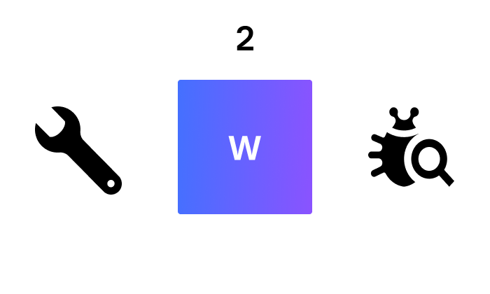
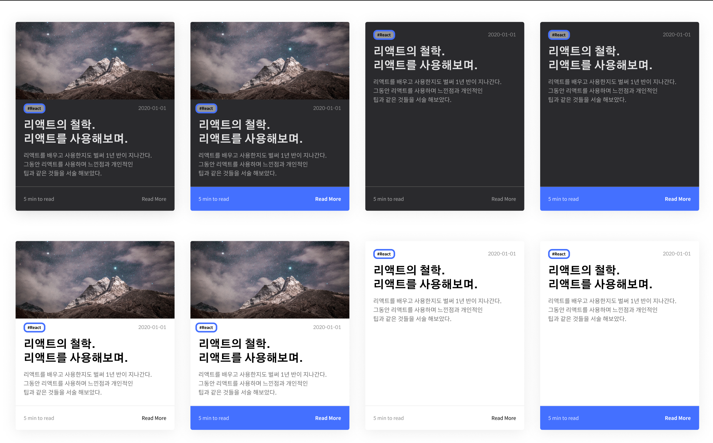

# 블로그 기능 업데이트와 Gatsby 스타터 개발

블로그를 개발, 배포하고 몇 개의 포스트를 작성한 후 `GraphQL`서버 개발을 잠깐 배우느라 블로그에 신경을 쓰지 못하였었습니다. 서버 개발에 조예가 없어 잠시 `GraphQL`서버 개발 학습을 접어두고 시험기간 직전까지 블로그 업데이트를 진행하였습니다.

## 버그 수정 💩

### CLI .DS_Store 관련 버그

맥에서는 파일 시스템에 접근할 때 .DS_Store 라는 숨겨진 파일이 생성됩니다. FInder에서 폴더를 생성하고 일일히 메타데이터를 넣어주는 방식으로는 문제가 없겠지만, `yarn create-post` 커맨드를 이용해 간단하게 포스트를 생성할 때 .DS_Store가 문제를 일으켰습니다.

문제를 발견된 곳은 `create-new-post.ts`의 getTags 함수 부분이었습니다. 해당 함수는 **recursive-readdir** 라는 라이브러리를 사용해 `content/articles` 내부의 디렉토리들의 파일들 중 이미지 파일들을 제외한, 즉 마크다운 파일들을 읽어들여 해당 파일들의 메타데이터에서 Tags를 추출해내는 기능을 합니다.

여기서 .DS_Store가 문제를 일으킵니다. recursive-readdir을 이용하여 파일들을 읽을 때 당연히 마크다운 파일이 없는 .DS_Store은 의도대로 읽어들일 수 없었고, 파일들의 배열애서 .DS_Store 부분이 undefined가 되어 이후의 로직에서 에러를 일으키는 것이었습니다.

해당 에러는 각 디렉토리에서 파일을 읽어들인 후 .DS_Store만 `Array.filter()`메소드를 사용하여 제거한 후 나머지 로직을 실행하는 방법으로 해결하였습니다.

## 기능 추가 🌈

### CLI 개선

포스트를 생성하는 CLI의 기능을 개선 / 추가하였습니다. 기존에는 포스트의 제목과 디렉토리 이름 겸 path를 반드시 따로 입력해야 했지만 디렉토리 이름을 따로 입력하지 않았을 경우에는 포스트의 이름으로 기본 디렉토리 이름을 설정하도록 하였습니다.

또한 따로 서술해놓지는 않았지만 정규표현식을 활용한 함수를 이용하여 디렉토리 이름에 '-' 대신 공백을 사용하여도 자동으로 '-'로 변환하도록 하였습니다.

```typescript
const replaceSpaceToDash = (str: string): string => str.split(/\s+/).join('-');
```

### 메인 페이지 UI 변경

개선이라 할 수 있는지 확실하지 않아 변경이라 서술하였습니다. 기존의 3열 그리드 레이아웃에서 4열 그리드 레이아웃으로 변경하였습니다.

다른 블로그 서비스를 둘러보다보니 제 블로그의 메인 페이지에 있는 아이템들의 폰트 크기가 좀 크다고 생각하게 되었습니다. 그래서 전체적인 포스트 아이템들의 UI를 변경하였습니다.

[Velog](https://velog.io)의 디자인을 참고하여 가로로 좀 더 작고 세로 길이는 유지하고 그 내부의 레이아웃을 조금 더 변경하기로 했습니다.



### About 파일 구조 변경

기존에 `src/pages/about.tsx` 파일에 내용까지 HTML로 작성하던 About 페이지를 `content/about`의 `index.md`에 내용을 작성하고 이것을 `about.tsx`에서 `pageQuery`로 가져와 렌더링 하는 방식으로 변경하였습니다.

`gatsby-source-filesystem`플러그인을 이용해 `content/about`의 파일을 읽어들인 후 이것을 `about.tsx`에서 `pageQuery`로 가져오는 과정과 `pages/index.tsx`에서 포스트 내용들을 가져오는 과정에서 문제가 발생했습니다. About 내용들과 블로그 포스트들이 모두 `allMarkDownRemark`라는 쿼리에 들어있는 것이 문제였는데요. 이 부분은

```graphql
query AboutPageQuery {
  allMarkdownRemark(filter: { frontmatter: { tags: { in: "#About" } } }) {
    edges {
      node {
        html
        frontmatter {
          title
          date(formatString: "YYYY년 MM월 DD일")
          tags
        }
      }
    }
  }
}
```

와

```graphql
query BlogIndexQuery {
  ...
  allMarkdownRemark(
    sort: { fields: [frontmatter___date], order: DESC }
    filter: { frontmatter: { tags: { nin: "#About" } } }
  ) {
    ...
  }
}
```

를 통해 About 내용만 가져오거나 About내용만 제외하고 가져오는 방식으로 해결하였습니다.

## 코드 개선점

### 구조 변경

기존의 컴포넌트마다 디렉토리를 만들어 `index.tsx`와 `styled.tsx`를 분리하여 코드를 작성하던 것을 변경하였습니다.

원래 사용하던 구조는 파일과 디렉토리 수가 너무 많고 스타일링 관련 코드들이 컴포넌트마다 분리되어 있으니 코드를 작성함에 있어서도 불편함이 많았습니다.

따라서 각 컴포넌트는 components 디렉토리 내의 `[컴포넌트 이름].tsx`로 변경하고, 스타일링 관련 코드는 각 컴포넌트의 최하단으로 이동하였습니다.

구조를 이렇게 변경함으로써 한결 보기 쉬워졌고, 코드를 작성함에 있어서도 더 편해졌다고 생각합니다.

## Gatsby 스타터 개발

제가 직접 디자인 / 개발한 이 블로그를 Gatsby의 스타터로 변경하여 깃허브에 푸시하였습니다. 혹시나 이 스타터를 사용하고 싶으신 분은 [gatsby-starter-devlog](https://github.com/WDever/gatsby-starter-devlog)로 이동하셔서 클론 받으신 후 사용해주시면 되겠습니다.

이렇게 업데이트를 하였지만 이번에도 메인 페이지의 UI에 대해 고민중입니다. 과연 글이 중심이 되는 블로그에 이런 UI가 어울리는지에 대해 생각을 해보고 있습니다.

꾸준히 유지보수하며 더 나은 UI / UX를 제공하도록 노력하겠습니다.
