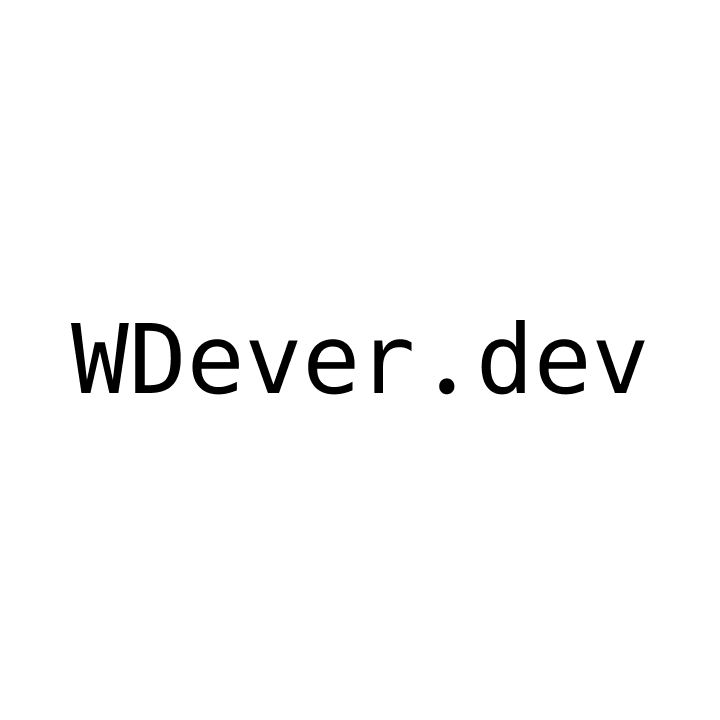
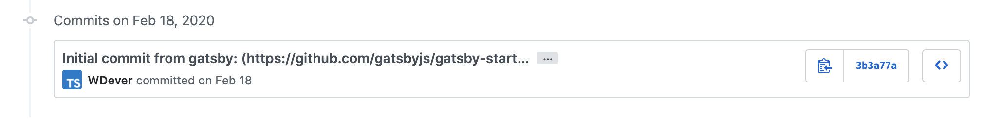

# 마침내 블로그를 완성했다.
첫 커밋이 2월 18일이다. 이렇게 오래 걸릴 건 아니었지만 아무튼 대략 3개월에 걸쳐 만들었다.

오래 걸린 것에 대해 변명을 할 수가 없다. 그냥 방학이라서 나태했고, 코로나까지 겹치며 정말 아무것도 안하는 상황이 되자 더욱 나태해져서 이렇게 오래 걸린 것이다.

물론 그 사이에 일이 아예 없지는 않았다. 작년에 시작된 프로젝트 [한빛](https://hanlight.kr)의 인력을 양성하기 위한 테크코스를 1월부터 진행하기도 했고, 한빛의 업데이트를 준비하기도 했다.

하지만 이렇게 오래 걸릴게 절대 아닌건 분명한 사실이다.

Velopert님이나 한재엽님 같은 분들의 [Velog](https://velog.io), [JBEE.io](https://jbee.io)를 보며 저런 블로그를 만들어서 나도 공부하는 걸 공유하고 싶다! 라고 생각은 꽤 오래 전부터 해왔다.

나도 이제 블로그를 만들었으니 꾸준히 글을 써서 나태함을 떨쳐버리도록 노력 해봐야겠다.

## 앞으로 쓸 글들

앞으로 쓸 글들을 조금은 생각을 해놨는데
- 블로그를 개발하며 마주친 이슈들
- 생애 첫 배포 경험
- 새로운 기술들을 배우는 과정
- 블로그의 버그와 새로운 기능들

이런 걸 써볼까 한다.

꾸준히 글을 써서 나의 포트폴리오 같은 느낌으로 만들어가고 싶다.
