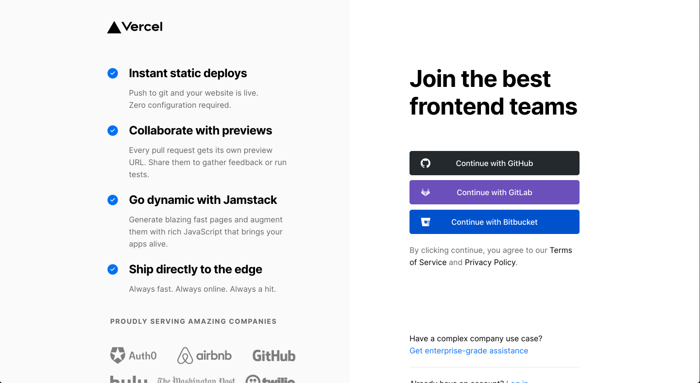
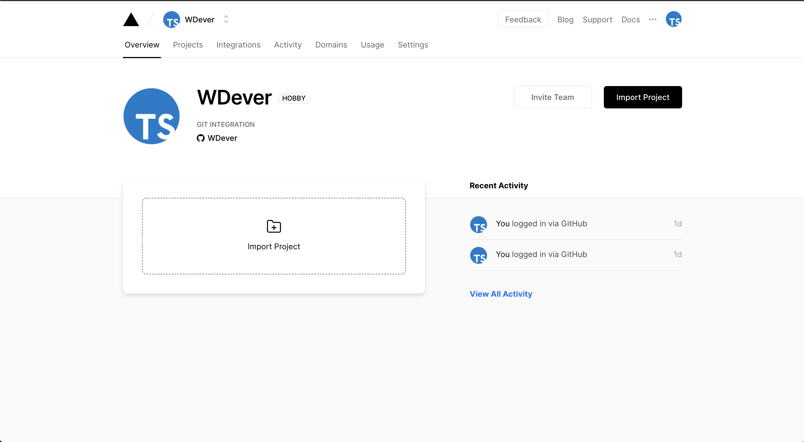
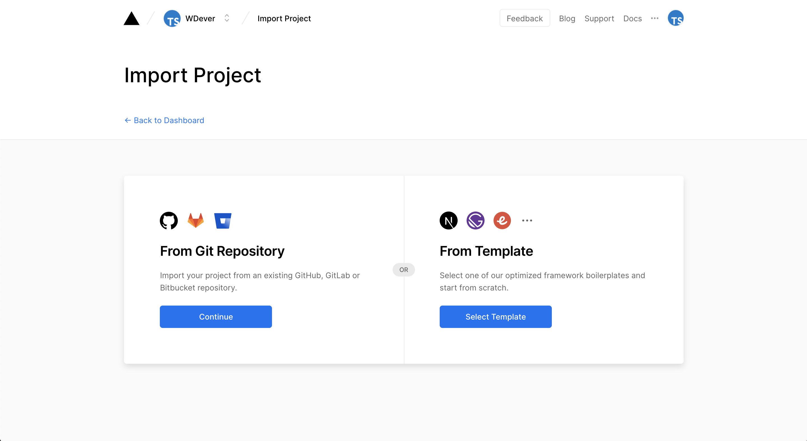
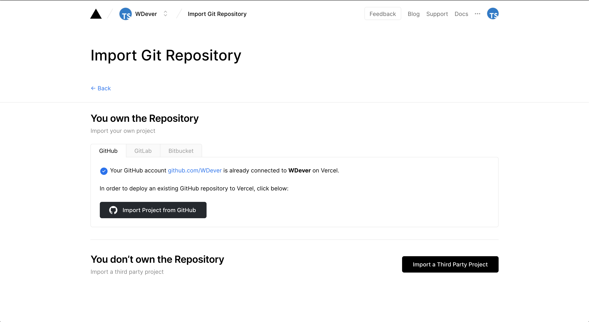
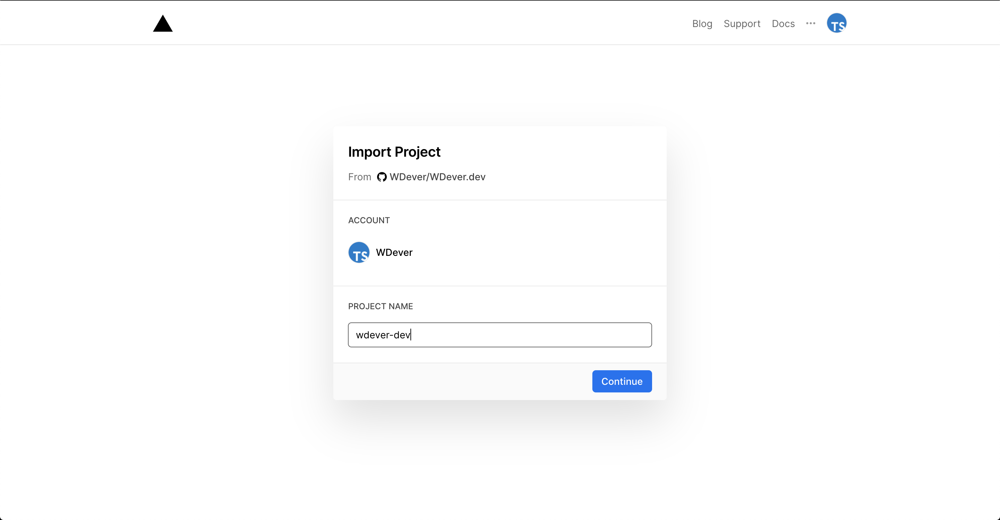
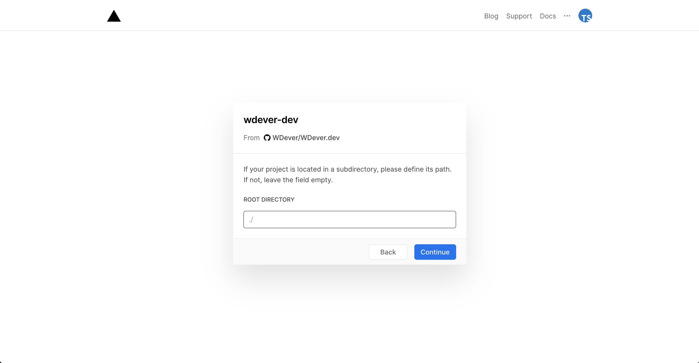
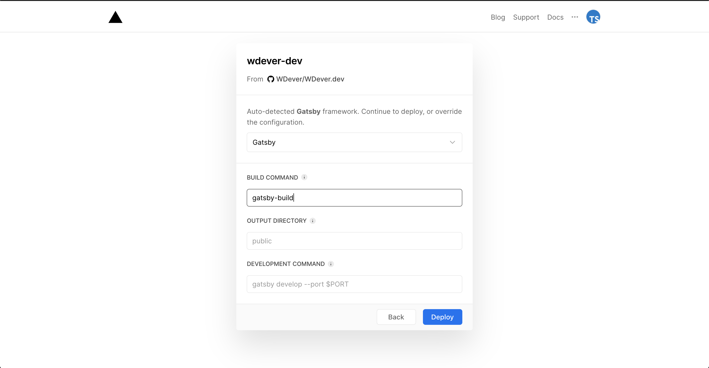
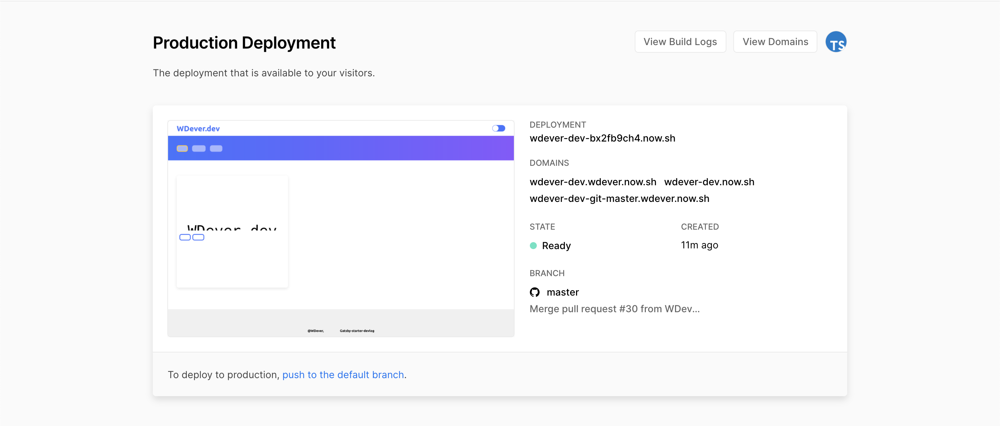

# Vercel로 Gatsby 웹앱 배포하기

Gatsby로 만들어진 많은 블로그들은 Netlify로 배포되곤 합니다. now는 Netlify에 비해 이용률이 좀 떨어지는 것 같은데 내가 한번 써보려 합니다. 그리고 now를 쓰려 한 이유 역시 소개합니다.

## Vercel? zeit now?

Vercel 인지 zeit now 인지를 우선 확실히 해야겠다. 원래는 zeit이었지만 4월 21일을 기점으로 21M 달러를 투자 받으며 사명을 Vercel로 바꾸었다. 자세한 사항은 Vercel의 [이 글](https://vercel.com/blog/zeit-is-now-vercel)에 있다.

zeit은 [Hyper](https://hyper.is/), [Next.js](https://nextjs.org/), [now](https://vercel.com/home)로 유명했는데, Vercel로 바뀌면서인지 now라는 명칭을 자주 쓰는 것 같지는 않다. 하지만 CLI에서는 아직 now라는 명칭을 사용하기에 이 글에서는 now를 사용하겠다.

## Vercel에 로그인하기

now를 사용하기 위해서는 우선 Vercel에 로그인을 해야한다.

GitHub, GitLab, Bitbucket의 선택지를 제공한다. 한가지를 선택해도 추후에 나머지 모두 연결할 수 있는 것으로 보여 자주 사용하는 것을 선택했다.

사실 로그인 과정에는 스크린샷을 찍지 않았고 과정도 기억 나지 않는다. 아쉽지만 바로 다음으로 넘어간다.

## 프로젝트 불러오기

로그인을 하면 다음과 같은 대쉬보드가 나타난다.

**Import Project** 라고 적힌 버튼을 아무거나 클릭하면 Git Repo에서 불러올지, 템플릿에서 불러올건지 선택할 수 있다.

난 GitHub에 올라가 있는 프로젝트를 불러올 것이므로 Git Repo로부터 불러오기를 선택했다.

난 이미 GitHub에 연결을 하였기 때문에 바로 Repo를 불러올 수 있다. GitHub에 연결하는 과정에 모든 Repo에 접근할 권한을 줄기 일부 Repo의 권한만 줄지 선택할 수 있는데, 편의를 위해 모든 Repo의 권한을 주었다.

불러올 저장소를 정하고 나면 다음과 같은 페이지로 이동된다. Vercel에서 사용할 프로젝트 이름을 정하고,

프로젝트의 Root Directory를 설정할 수 있다. 프로젝트가 어떤 디렉토리에 들어 있다면 설정 해줘야 하지만 난 그런 거 없다. 비워두면 알아서 ./ 경로로 설정된다.

Root Directory를 설정하면 똑똑한 now가 알아서 어떤 프레임워크를 사용했는지 감지 후 설정 해준다.

그리고 문제의 Build Command인데, 난 package.json에서 build 커맨드를 내 입맛에 맞게 `rm -rf .cache public && gatsby build` 로 변경 해주어서 일반적인 커맨드인 `gatsby build` 로 설정해준다는게 `gatsby-build` 로 설정 해버렸다. 이 실수 때문에 한번 배포가 실패하였다.

혹시나 이 글을 보고 따라하는 분이 있다면 절대 이런 실수를 하지 않으시길..

나머지는 그냥 비워두고 Deploy를 누르면 그냥 바로 배포가 진행된다.

그냥 바로 배포가 진행되어 놀랐는데 아주 잘 되었다. 도메인은 여러개가 생성되는데 추후에 설정을 통해 커스텀 도메인을 설정하려 한다.

## 난 왜 Verel now를 사용했는가.

사실 배포를 위한 서비스는 많다. [Netlify](https://www.netlify.com/)라던가 GitHub를 사용하면 GitHub Pages도 있고, AWS를 사용해도 된다.

그중에서도 Netlify가 상당히 높은 이용률을 가지고 있는걸로 안다. 하지만 내가 Netlify로 배포된 여러 웹 페이지와 블로그를 다니며 속도가 조금 느린 것 같다는 생각을 하게 되었다.

요즈음에는 속도가 빠른 듯 하지만 한두달 전까지만 해도 첫 로딩에 수 분이 걸린 적이 있을 정도로 느려지는 경우가 있었다. 그래서 대안을 모색해 봤고, 가장 나은 대안이 now라 생각하여 선택했다.

## 크게 만족한다.

Vercel now를 사용하여 배포를 해봤는데 일단 크게 만족한다. 쉽고, 빠르고, 친절하다. now의 웹 페이지도 빠르고 훌륭한 UI를 가지고 있다. 혹시 또 한번 배포할 일이 생기면 다시 선택할 수 있을 것 같다.

이 글은 배포와 동시에 스크린샷을 찍으며 작성했다. 배포 후 좀 큰 모니터를 사용해보니 문제가 있어보여 일단 그 부분을 수정하려 한다.

다음 글은 이슈 수정과 커스텀 도메인 설정이 될 것 같다.

---

여기서는 Vercel now와 Gatsby에 대해서만 다뤘다. 다른 배포 플랫폼인 Netlify나 GitHub Page가 궁금하다면 [taenyKim님의 글](https://taeny.dev/javascript/nextjs-with-deployment-platform/)을 참고하면 좋을 것 같다.
