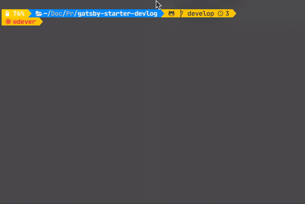

# Gatsby-starter-devlog

Gatsby starter for developer's blog.

## Demo

[demo](https://gatsby-starter-devlog.vercel.app/)

> Tell me if you use this starter

## Features

- Grid View 🌈
- Code Highlight ✨
- Comment with Utterances 💬
- Buy me a coffee ☕️💸
- Google Analytics 📊
- Considered UI / UX 🤓
- Dark Mode Support !!! 🌗

## Getting Start

1. Create a Gatsby app

```sh
yarn gatsby new my-blog https://github.com/WDever/gatsby-starter-devlog

or

npx gatsby new my-blog https://github.com/WDever/gatsby-starter-devlog
```

2. Start development server

```sh
yarn develop

or

npm run develop
```

3. Create your post

Create post in `content/articles` with **cli!!!**



4. Write your post

You can write your content wit GitHub Flavor Markdown.

Also you can add thumbnail images or not. If you won't add thumbnail images, remove `image` in metadata

5. Deploy to vercel

[](https://vercel.com/import/project?template=https://github.com/WDever/gatsby-starter-develog)

## Structure

### root

```sh
/root
├── .eslintrc.json // eslint config file
├── .prettierrc // prettier config file
├── gatsby-browser.js // font, code style
├── gatsby-config.js // Gatsby config & metadata
└── gatsby-node.js // import gatsby files from lib
```

### src

```sh
src
├── components // Components with styling & some logic
├── hooks // Hooks that useful
├── lib // Fonts & gatsby files rewrite with TypeScript
├── pages // Routing except post: /(home), /about, /404
├── templates
│   ├── blog-post.tsx
│   └── home.tsx

├── types // Types that generate by graphql-codegen
└── utils
    ├── functions // Useful functions
    └── hooks //
```

### content

```sh
content
├── about // About you / resume
│   └── index.md
│
├── articles //  Posts
│   ├── my-first-post-example // Name of this directory will be the path
│       └── index.md // and some pictures or more...
│
├── assets
    ├── profile-pic // Profile picure that will use in BIO
    └── wdever-icon // Icon will be show in tab.
```

## Customize

### Tab Icon

Replace `assets/wdever-icon` with your own icon and change path in `gatsby-plugin-manifest`. This config is in the `gatsby-config`

### Profile Image

Replace `assets/profile-pic` with your own profile pic

### Utterances

Add your repo name (username/repo) in `gatsby-config.js/siteMetadata.repo`

### Google Analytics

Add tour trackingId in `gatsby-config.js/gatsby-plugin-google-analytics.options.trackingId`

## Contributing

I'm always waiting you guys's contribute. Please Contribute.

Thanks.
