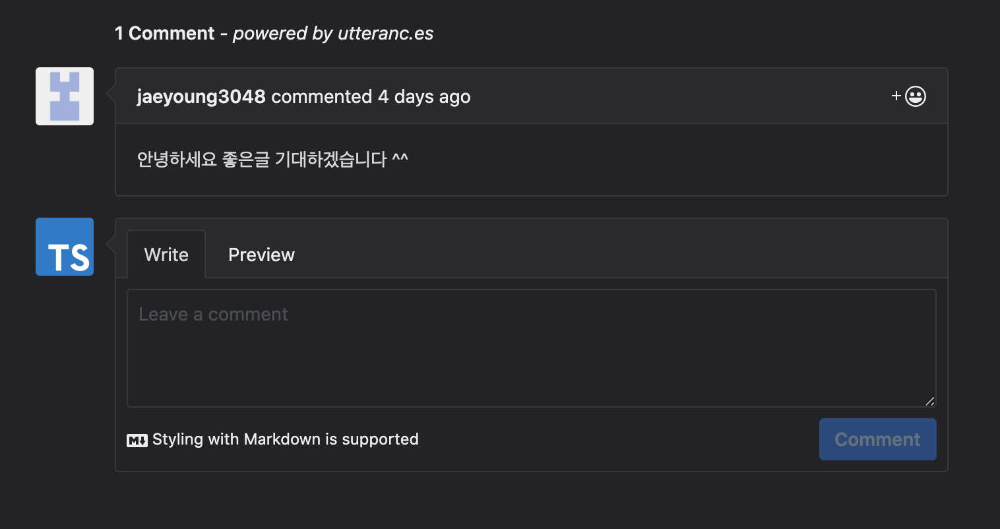

# 마침내 나만의 블로그가 생기다.

사실 개발 관련 포스팅을 할 곳은 많았습니다. 티스토리도 초대장 제도가 있던 시절에 초대장을 받았고, [Velog](https://velog.io)나 동아리 [Medium](https://medium.com/wasd)도 있습니다. 하지만 웹 개발자로써 스스로 개발하고 싶다는 생각을 가지고 있었기 때문에 직접 만들게 되었습니다.

이 포스트에는 이 블로그에 사용된 기술, 핵심 기능, 배우고 생각했던 것들을 서술하려 합니다.

## 왜 직접 블로그를 개발하였는가?

상술했듯이 개발 관련 글을 쓸 곳은 이제 꽤 많다. 하지만 [JBEE.io](https://jbee.io)나 [벨로퍼트님의 예전 블로그](https://velpert.com) 혹은 [Dan Abramov의 블로그](https://overreacted.io)나 [Kent의 블로그](https://kentcdodds.com/)를 보며 직접 블로그를 개발하고 싶다는 생각을 하게 되었다.

마침 [한재엽님의 포스트](https://jbee.io/etc/intro-new-blog/)를 보고 나도 직접 만들 수 있지 않을까 하는 생각이 들었고, `GraphQL`에 관심이 있는 김에 `Gatsby`로 직접 블로그를 개발해보고 배포까지 해보자고 마음을 먹었다.

## 사용한 기술 / 도구

- **Gatsby**
- TypeScript
- styled-components
- Vercel
- Google Analytics

정도가 핵심이라 볼 수 있을 것 같다.

### Gatsby

`Gatsby`는 리액트 프레임워크로써 플러그인으로 정말 다양한 기능을 제공해준다. 물론 `hexo` 같은 프레임워크가 있었으나 내가 `React`를 배우기 때문에 `Gatsby`가 더 적절해 보였다. 또한 `GraphQL`을 이용해 데이터를 조작하기 때문에 더더욱 마음에 들었다. `GraphQL`맛보기라도 해보자 하고 `Gatsby`를 사용했다.

`Gatsby`는 빠른 개발을 위해 많은 템플릿을 제공하고 사용자가 직접 만들수도 있는데, ['gatsby-starter-blog`](https://www.gatsbyjs.org/starters/gatsbyjs/gatsby-starter-blog/)를 기반으로 내가 생각한 기능들을 추가하여 개발했다. [한재엽님의 `gatsby-starter-bee`](https://github.com/JaeYeopHan/gatsby-starter-bee)를 보고 자극을 받아 만들었다.

`GraphQL`을 이미 사용중인 개발자라면 알고 있겠지만 [`graphql-codegen`](https://graphql-code-generator.com/)을 이용해 `Gatsby`의 쿼리문의 타입을 정말 쉽게 정의할 수 있었다.

[이 글](https://velog.io/@iamchanii/build-a-blog-with-gatsby-and-typescript-part-3)을 보고 따라하려 했으나 나의 경우에는 잘 적용되지 않아 따로 [문서](https://graphql-code-generator.com/docs/integrations/gatsby/)를 보고 적용 후 script를 만들어 적용했다.

`graphql-codegen`의 존재를 알기 전까지는 직접 콘솔로 찍어보고 타입을 확인한 후 인터페이스를 만들어 적용 해줬는데 정말 간단하게 쿼리의 타입을 알 수 있게되어 편했다.

### TypeScript

`TypeScript`는 이제 나에게 있어 없어서는 안될 존재라고 생각한다. 물론 엄청난 개발자분들처럼 타입을 잘 다루지도 못하고 숙련도가 떨어지지만 그럼에도 `TypeScript`가 제공하는 이점은 내가 개발함에 있어 압도적인 편리함을 느끼게 해줬다.

### styled-components

`styled-components`를 사용해 다크테마를 보다 간단하게 적용하고, 조건부 스타일링 역시 props로 편하게 할 수 있어 선택했다.

### Vercel

[이전 포스트](https://wdever.dev/deploy-with-vercel/)에서도 말했듯이 문서도 많고 사용자도 많은 Netlify 대신 Vercel을 선택했다. 개인적으로 좋은 선택이었다고 생각한다. Netlify에서 제공하는 기능들을 대부분(Netlify를 사용하지 않아 잘 모른다) 제공한다. 또한 Netlify로 배포된 사이트들이 굉장히 느려지는 경우가 있었던 것에 비해 속도도 빠르다고 생각한다.

커스텀 도메인 설정 역시 어렵지 않았다. 나의 경우에는 Google Domains를 사용하여 도메인을 구매하고 적용했다.

Vercel과 관련된 포스트는 다음 두 개가 있다.

1. [Vercel(now)로 블로그를 배포해보자](https://wdever.dev/deploy-with-vercel/)
2. [Vercel now와 Google Domains 커스텀 도메인 설정](https://wdever.dev/set-custom-domain-with-vercel-and-google-domain/)

## 핵심 기능

### 1. 태그

많은 블로그들이 카테고리 기능을 사용한다. 심플한 블로그들은 카테고리 기능마저 없기도 하다. 하지만 나는 개발자 분들의 블로그를 정보를 얻고 배우기 위해 주기적으로 방문한다. 그럴 때 카테고리 기능 혹은 검색 기능마저 없는데 글이 많다면 상당히 불편함을 느꼈다.

사용자 입장에서 카테고리보다 원하는 글에 빠르고 직관적으로 접근할 수 있는 기능이 없을까 생각해봤을 때 카테고리보다는 태그 기능이 낫지 않을까 생각했다. 내가 글을 쓸 때 글의 주제와 연관 있는 태그를 선택하고 글을 작성하면 사용자는 원하는 주제의 태그를 선택하여 쉽게 원하는 글에 접근할 수 있을거라 생각했다.

markdown 파일의 frontmatter에 태그를 추가하여 포스트의 태그를 정해줬고, `GraphQL`을 통해 포스트의 태그 데이터를 가져와 사용자가 선택한 태그의 포스트만 보여주도록 하였다.

또한 현재 어떤 태그의 포스트를 탐색중인지 헤더에서 알려주는 기능 역시 포함하였다.

### 2. 댓글

블로그에 있어 빠져서는 안되는 기능 중 하나라고 생각한다. 나 역시 배우는 입장이기 때문에 포스트에 틀린 내용이 있을 수 있다. 그런 점을 혹시 사용자가 지적해줄 수 있다고 생각한다. 또한 블로그 자체에 대한 피드백 역시 받을 수 있을것이라 생각한다.

요즘 많이들 사용한느 [utterances](https://utteranc.es/) 를 이용해 댓글을 적용하였다. GitHub의 이슈를 이용해 댓글 기능을 구현한 것인데 아이디어가 굉장히 좋다고 생각한다.

### 3. 공유

혹시 내가 성장하여 정말 도움이 되는 글을 작성하였을 때 해당 포스트의 링크를 공유할 수 있는 기능을 만들어 보았다. [`clipboard api`](https://developer.mozilla.org/ko/docs/Web/API/Clipboard_API)를 이용하여 해당 페이지의 주소를 복사할 수 있도록 만들었다.

다만 이 정도의 기능으로는 부족하고 추후 SNS로 바로 공유할 수 있는 기능을 추가해보려 한다.

### 4. 다크 모드

요즘 대세는 다크 모드라 해도 과언이 아니다. [`CRA의 공식 문서`](https://create-react-app.dev/docs/getting-started/) 혹은 [`Gatsby`](https://www.gatsbyjs.org/) 역시 다크 모드를 지원한다. 또한 많은 블로그가 다크 모드를 지원한다.

나 역시 다크 모드를 좋아한다. 내가 사용하는 것에 다크 모드가 있다면 대부분 사용한다. 다크 모드는 사용자에게 밝은 테마와 어두운 테마의 두 가지 선택지를 제공하고, 가독성을 높일 수 있다는 장점이 있다고 생각한다. 또한 어두운 환경에서는 눈이 더 편한 점 역시 장점이라 볼 수 있다.

나의 블로그에도 다크모드를 지원한다. `styeld-components`의 `ThemeProvider`를 통해 간단하게 다크모드를 적용할 수 있었다. 관련 포스트를 작성 해보고 싶기도 하다.

## 생각한 것

### 1. 메인 페이지 레이아웃

많은 블로그가 수직으로 포스트를 쌓아놓은 레이아웃을 사용한 것으로 안다. 난 왜 디스플레이의 넓이를 충분히 활용하지 않고 좁을 영역에 쌓는지 알 수 없었다. 그래서 [Velog](https://velog.io) 혹은 [log rocket의 블로그](https://blog.logrocket.com/) 처럼 그리드 형식의 레이아웃을 적용해보았다.

물론 내가 알지 못하는 단점이 있을 수 있다고 생각하지만 아직까지는 만족하는 중이다. 모바일은 몰라도 큰 화면을 가진 디바이스에서는 그리드 형식이 더 나은 레이아웃이라 생각한다.

### 2. 타이포그래피 디자인

내 블로그이니만큼 디자인 역시 내가 직접 했다. 보상을 해줄 수 없으니 디자이너에게 맡길 수 없지 않은가?

원래 디자인에서는 포스트 페이지의 넓이가 1000픽셀을 넘어갔다. 사진처럼.

위에서 말했던 것처럼 난 넓은 화면을 최대한 활용하고 싶었다. 하지만 포스트의 디자인에서는 그래서는 안된다는 걸 다음 두개의 글을 보고 알게 되었다.

1. [신연석님의 글](http://shinyeonseok.com/typography-for-gui/)
2. [한글 웹 타이포그래피 디자인](http://creativemag.creative-band.co.kr/typography/%ED%95%9C%EA%B8%80-%EC%9B%B9-%ED%83%80%EC%9D%B4%ED%8F%AC%EA%B7%B8%EB%9E%98%ED%94%BC-%EB%94%94%EC%9E%90%EC%9D%B8/)

그래서 우선 마지노선이라는 720px로 줄여봤다. 별로였다. 그래서 더 줄이려니 너무 작은 것 같았다. 고심 끝에 700px로 하기로 했다. 700px 정도면 사용자들도 피로를 덜 느끼고 화면을 나름 잘 활용하는 것 같다는 생각이 들었다.

또한 글줄 사이, 행간, 즉 `css`에서는 `line-height`를 조정했다. 확실히 조금 넓은 것이 가독성에 더 낫다고 느꼈다.

폰트는 [팀 프로젝트](https://hanlight.kr)에서 주로 사용했던 **Spoqa Han Sans**를 주로 사용했다. Spoqa에서 오픈 폰트 라이선스로 공개하여 사용할 수 있었다. 그 외에 `h1`, `h2` 혹은 제목 부분에는 **Gothic A1**를 사용했다. 한글을 지원하는 깔끔한 폰트라 생각했다. **Ubuntu** 폰트 또한 블로그 타이틀 같은 부분에 사용했다.

코드 스니펫은 [`atom one dark`](https://github.com/AGMStudio/prism-theme-one-dark) 테마를 사용했다. 개발자들에게 익숙한 테마면서도 보편적으로 예쁜 테마라고 생각했다. `Gatsby`에서 `prismjs`를 지원해서 간단하게 적용할 수 있었다.

## 구현 못한 / 삭제된 기능

### 1. Grid를 Flex로 바꾸기

`Grid`를 사용해 메인 페이지를 스타일링 하다가 대부분의 그리드 뷰 를 사용하는 웹들이 `Flex`를 사용하는 것을 보고 `Flex`를 사용하려 했으나 난 IE를 지원할 생각이 없고, 아무래도 코드으 양이 `Grid`보다 훨씬 많아지는 것 같아 보류했다.

혹시 추후에 `Flex`의 필요성을 느끼면 바꿀 가능성이 있다. `Flex`에서도 `Grid`의 gap과 같은 속성이 나올 수도 있다는 소식에 기다리는 중이기도 하다.

### 2. RSS

필요성을 못느꼈으나 이것은 내가 잘 몰라서일 수도 있기 때문에 보류했다. `gatsby-plugin-rss`는 아직 있으니 언제든 적용 가능할 것이다.

### 3. ToC

굉장히 구현하고 싶은 기능이었다. 개인적인 경험으로 ToC가 있는게 훨씬 포스트를 보기 편했기 때문에 꼭 구현하려 했으나 URL에 #[헤더]를 써도 이동이 되지 않았기 때문에 보류했다. [`gatsby-remark-autolink-headers`](https://www.gatsbyjs.org/packages/gatsby-remark-autolink-headers/)를 알게 되어 조만간 개발할 수 있을 것 같다.

### 4. 헤더에 있던 다수의 기능

원래는 헤더에서 다양한 정보를 보여주는 기능을 생각하고 있었다.

1. 현재 포스트의 제목
2. 현재 포스트의 태그
3. ToC

하지만 공간이 부족할 수 있다는 점, 실용성이 부족하다는 점 때문에 삭제했다. 추후 ToC를 개발한다면 그 쪽에 추가할 수 있지 않을까 싶다.

## 앞으로 해나갈 것

### 1. 프로젝트 구조

현재 블로그의 파일 구조가 별로라고 생각한다. 각 컴포넌트는 하나의 폴더를 만들어 `index.tsx`와 `style.tsx`로 `JSX` 부분과 `styled-components`부분을 나눠놓고 있다. 내 생각에 나쁘지 않을 것 같아 적용한 구조이지만 괜히 복잡성을 올렸다고 생각한다. 그냥 `index.tsx`에 하나의 컴포넌트에 필요한 코드들을 모두 넣는 것이 차라리 나을 것이라 생각한다.

혹은 폴더도 없이 하는 구조도 생각중이다. 하나의 컴포넌트는 하나의 파일만 있으면 되기 때문에 굳이 컴포넌트가 필요하지 않다고 생각한다.

로직이 너무 여기저기 있는 것도 별로라고 생각한다. 로직들은 모두 커스텀 훅으로 만들어 따로 빼놓고 정해진 파일에서만 로직을 사용하고 싶다.

### 2. ToC

화면이 큰 디바이스에서만 유효한 기능이지만 있으면 정말 좋다고 생각한다. 꼭 개발하고 싶다.

### 3. 더 다양한 공유

다양한 SNS로 직접 공유하는 기능을 만들고 싶다. 빨리 배포하고 싶다는 생각에 미뤄뒀었지만 빠른 시일내에 추가하고 싶은 기능이다.

> 꾸준히 포스트를 작성하여 나를 비롯한 많은 사람들에게 도움이 되는 블로그로 만들어 나가고싶다.
