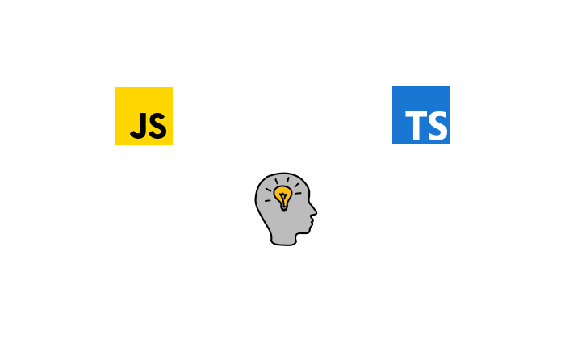

> 평어체를 사용합니다.



# 코딩테스트 연습하기

프로그래머스 2019 카카오 개발자 겨울 인턴쉽 크레인 인형뽑기 게임 문제를 풀어봤다. 원래 2019 카카오 개발자 겨울 인턴쉽에 지원해서 풀어봤던 문제다. 당시에는 문제를 하나도 풀지 못하였고, 이제와서 다시 한번 풀어보았다.

## 문제

이미지를 포함한 더 자세한 문제는 [링크](https://programmers.co.kr/learn/courses/30/lessons/64061?language=javascript)에서 확인할 수 있다.

게임개발자인 **죠르디**는 크레인 인형뽑기 기계를 모바일 게임으로 만들려고 합니다.
**죠르디**는 게임의 재미를 높이기 위해 화면 구성과 규칙을 다음과 같이 게임 로직에 반영하려고 합니다.

### 규칙

- 게임 화면은 **1 x 1** 크기의 칸들로 이루어진 **N x N** 크기의 정사각 격자
- 위쪽에는 크레인이 있고 오른쪽에는 바구니가 있습니다.
- 각 격자 칸에는 다양한 인형이 들어 있으며 인형이 없는 칸은 빈칸
- 모든 인형은 **1 x 1** 크기의 격자 한 칸을 차지하며 격자의 가장 아래 칸부터 차곡차곡 쌓여 있습니다.
- 사용자는 크레인을 좌우로 움직여서 멈춘 위치에서 가장 위에 있는 인형을 집어 올릴 수 있습니다.
- 이때 바구니의 가장 아래 칸부터 인형이 순서대로 쌓이게 됩니다.
- 만약 같은 모양의 인형 두 개가 바구니에 연속해서 쌓이게 되면 두 인형은 터뜨려지면서 바구니에서 사라지게 됩니다.
- 크레인 작동 시 인형이 집어지지 않는 경우는 없으나 만약 인형이 없는 곳에서 크레인을 작동시키는 경우에는 아무런 일도 일어나지 않습니다.
- 또한 바구니는 모든 인형이 들어갈 수 있을 만큼 충분히 크다고 가정

게임 화면의 격자의 상태가 담긴 2차원 배열 board와 인형을 집기 위해 크레인을 작동시킨 위치가 담긴 배열 moves가 매개변수로 주어질 때, 크레인을 모두 작동시킨 후 터트려져 사라진 인형의 개수를 return 하도록 solution 함수를 완성해주세요.

### 제한사항

- board 배열은 2차원 배열로 크기는 **5 x 5** 이상 **30 x 30** 이하입니다.
- board의 각 칸에는 0 이상 100 이하인 정수가 담겨있습니다.
  - 0은 빈 칸을 나타냅니다.
  - 1 ~ 100의 각 숫자는 각기 다른 인형의 모양을 의미하며 같은 숫자는 같은 모양의 인형을 나타냅니다.
- moves 배열의 크기는 1 이상 1,000 이하입니다.
- moves 배열 각 원소들의 값은 1 이상이며 board 배열의 가로 크기 이하인 자연수입니다.

### 입출력 예

| board                                                         |       moves       | result |
| ------------------------------------------------------------- | :---------------: | -----: |
| [[0,0,0,0,0],[0,0,1,0,3],[0,2,5,0,1],[4,2,4,4,2],[3,5,1,3,1]] | [1,5,3,5,1,2,1,4] |      4 |

인형의 처음 상태는 문제에 주어진 예시와 같습니다. 크레인이 [1, 5, 3, 5, 1, 2, 1, 4] 번 위치에서 차례대로 인형을 집어서 바구니에 옮겨 담은 후, 상태는 아래 그림과 같으며 바구니에 담는 과정에서 터트려져 사라진 인형은 4개 입니다.

## 풀이

### 2019년 겨울 풀이

말했듯이 2019년 겨울에도 지원했었다. 그때는 다음과 같은 코드로 시도해보았다.

```typescript
function solution(board: number[][], moves: number[]) {
  let answer = 0;

  const copiedBoard = board.map((item, idx, org) =>
    org.map((val, valIdx) => board[valIdx][idx]),
  );

  let stack = moves
    .map((item, idx, org) => {
      const temp = copiedBoard[item - 1].reduce((acc, cur, i) => {
        if (acc === 0) {
          if (cur === 0) {
            return 0;
          }
          copiedBoard[item - 1][i] = 0;
          return cur;
        }

        return acc;
      });

      return temp;
    })
    .filter((item) => item);

  for (let v = 0; v < moves.length; v += 1) {
    for (let i = 0; i < stack.length - 1; i += 1) {
      for (let j = i + 1; j <= i + 1; j += 1) {
        if (stack[i] === stack[j]) {
          answer += 1;
          stack[i] = 0;
          stack[j] = 0;
          stack = stack.filter((item) => item);
        }
      }
    }
  }
  return answer * 2;
}
```

코드를 짠 후 다시 보지 않았던 터라 포스트 작성을 위해 다시 이 코드를 이해하는데 조금 힘들었다.

세로 형태의 스택에 쌓이는 인형들이 각 배열의 인덱스 순으로 다르게 들어있다.

예를 들어 1번 라인에는 0, 0, 4 순 2번 라인에는 0, 2, 3 순 3번 라인에는 1, 2, 5 순으로 들어있을 것이지만 사실 배열은 [[0, 0, 1], [0, 2, 2], [4, 3, 5]]로 들어온다. 이것을 원하는 형태 즉, 1번 라인에는 0, 0, 4 순 2번 라인에는 0, 2, 3 순 3번 라인에는 1, 2, 5 순으로 바꾸기 위해서 `copiedBoard` 변수에 map함수를 두번 사용한 것이다.

`stack` 변수에서 `Array.map()` 메소드와 `Array.reduce()` 메소드를 사용하여 `moves`의 순서대로 `copiedBoard`변수에서 인형을 뽑아 저장한다.

이후 3중 for문을 사용해 `moves`의 길이만큼 `stack`에서 앞뒤가 붙어있는 것들을 여러번 검사하여 결과를 낸다.

내가 짠 코드지만 다시 보고 이해하는데 조금 힘들었다. 그리고 실제로 이 코드는 제대로 작동하지 않아 문제를 제대로 풀지 못했다.

### 2020년 풀이

```typescript
function solution(board: number[][], moves: number[]) {
  let answer = 0;
  const basket = [];

  const copiedBoard = board.map((item, i, org) => {
    return org.map((val) => val[i]).filter((orgItem) => orgItem);
  });

  for (let i = 0; i < moves.length; i += 1) {
    const selectedIdx = moves[i] - 1;
    const cur = copiedBoard[selectedIdx].shift();
    const curBasket = basket[basket.length - 1];
    if (curBasket && cur === curBasket) {
      answer += 2;
      basket.pop();
    } else {
      basket.push(cur);
    }
  }

  return answer;
}
```

2019년 풀이보다는 훨씬 코드가 줄어든 모습이다.

2019년 코드처럼 `copiedBoard`변수에 인형을 세로 스택 형태로 바꿔서 저장해준다. `moves`배열의 길이만큼 for문을 이용하여 `copiedBoard`에서 `Array.shift()` 메소드를 사용하여 가장 위에 있는 인형을 가져와준 후, `basket`에서 가장 위에 있는 인형과 비교한다. `basket`에서 가장 위의 인형을 가져오는데 `basket[basket.length - 1]`로 가져오는 것은 나중에 인형을 넣어줄 때 `Array.push()` 메소드를 사용하기 때문이다. 가장 최근에 추가된 인형은 가장 마지막 인덱스에 있다.

그리고 두 인형이 일치한다면 `answer`변수의 값을 2 증가시키고, `basket.pop()`을 통해 일치하는 인형을 제거해준다. 만약 일치하지 않는다면 `basket.push()` 메소드를 통해 현재 비교하던 인형을 추가해준다.

인형을 비교한 후, 일치하지 않는다면 현재 비교하던 인형을 추가하고, 일치한다면 추가하지 않고 `basket`에서 인형을 제거함으로써 자연스럽게 연속된 두 인형을 터뜨리는 효과가 된다.

원래는 지난번처럼 `basket` 배열에 `moves`의 순서대로 `copiedBoard`에서 뽑은 인형을 차례대로 넣어준 후 다시 반복문을 몇 번 돌려 해결해보려 했으나 반복문을 여러번 사용해야 했다. 무엇보다 채점을 했을 때 **케이스 1, 2번**에서 자꾸 실패하여 방법을 바꿔보았다.

지금 포스트를 작성하며 다시 보니 `basket`에 인형을 추가하거나 인형을 가져올 때 `Array.shift()` 혹은 `Array.unshift()` 를 사용할 수 있었을 것 같다. 하지만 현재 코드가 더 이해하기 쉬울 수도 있다고 생각하여 만족한다.

## 배운 점

개인적으로 자료구조, 알고리즘이 나의 큰 약점중 하나이고, 잘하고 싶지만 정말 못한다 생각한다. 하지만 학교에서 배운 **Stack** 자료구조에 대해 조금 이해가 있다보니 비록 그 컨셉을 효과적으로 사용한 것 같지는 않지만 이번에는 한결 쉽게 풀 수 있었던 것 같다. 2019년에서 지금까지 다양한 코드들을 접해보고 작성해보며 더 간결한 코드를 작성할 수 있었던 것도 도움이 되었다고 생각한다.

레벨 1임에도 어렵게 느껴졌지만 풀고 나니 성취감을 느꼈다. 앞으로 꾸준히 문제를 풀어서 실력을 늘리고 싶다.
