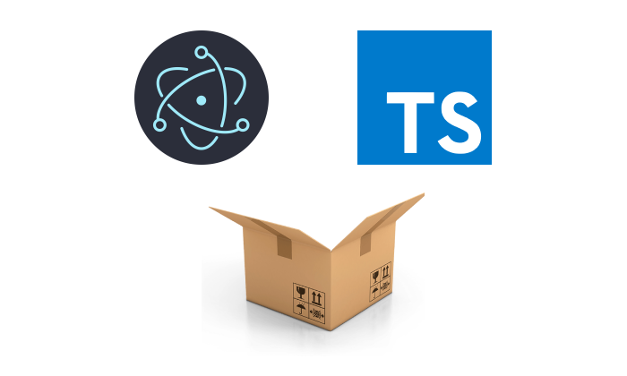
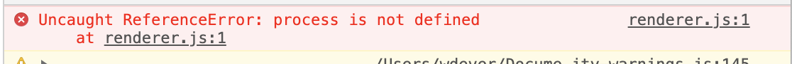
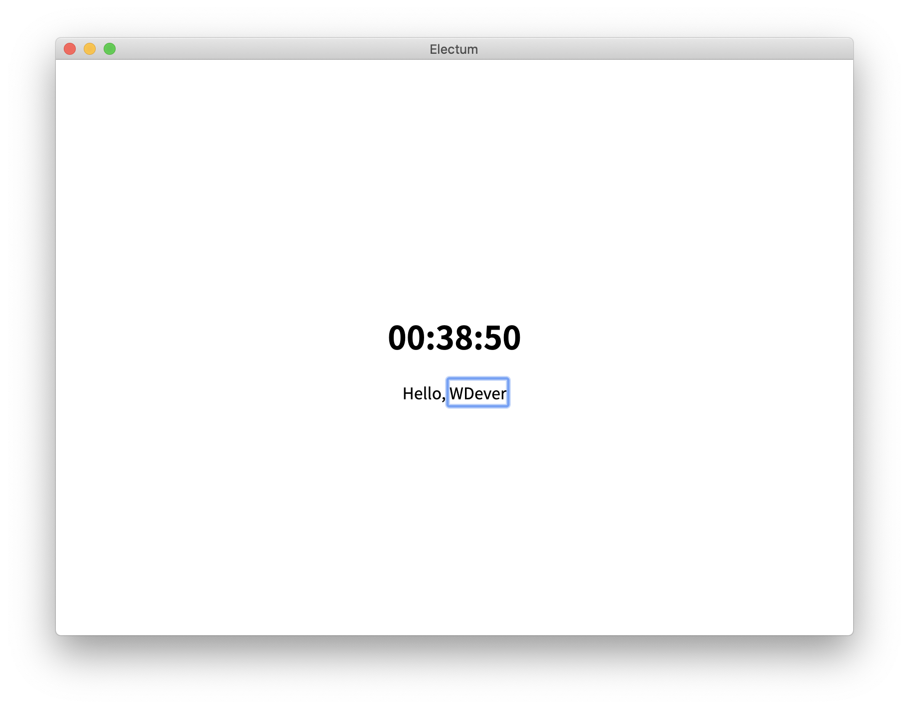

# 일렉트론을 배워보자. 일단 리액트 없이.

저는 바닐라JS로 개발을 거의 안 해보고 바로 리액트로 넘어온 케이스입니다. 일렉트론을 배우는 김에 한번 리액트와 같은 라이브러리 없이 개발해보고자 하였습니다.

> 이 포스트에는 정확하지 않은 정보가 포함되어 있을 수 있습니다.

## 일렉트론을 배우려는 이유

일렉트론은 JS, HTML, CSS와 같은 웹 기술로 맥, 리눅스, 윈도우에 모두 대응하는 데스크탑 앱을 만들 수 있게 해준다. 난 이것이 굉장한 장점이라고 생각한다. 당장 나는 HTML, CSS, JS 밖에 할 줄 모르는 평범한 프론트엔드 배우는 사람인데, 데스크탑 앱을 만들고 싶다면? 일렉트론 없이는 새로운 언어, 새로운 라이브러리, 프레임워크를 배워야 할 것이다. 내가 할 줄 아는 것만으로 데스크탑 앱을 만들 수 있다면 난 일렉트론을 배우지 않을 이유가 없다.

그리고 이것이 많은 기업들이 일렉트론을 선택하는 이유 아닐까 싶다. [일렉트론 홈페이지](https://www.electronjs.org/)에 들어가보면 어떤 앱들이 일렉트론으로 만들어져있나 나와있다. 추가로 헤더의 앱을 클릭하면 더 많은 앱들을 볼 수 있다.

정말 많은 개발자들이 사용하는 VScode, Atom, PostMan, Insomnia. 디자인 협업 툴인 Figma, Zeplin. 많은 기업에서 사용하는 Slack, Notion. 게임할 때 사용하는 Discord. 심지어 페이스북의 Messenger 데스크탑 앱 역시 일렉트론으로 만들었다.

모두 내가 사용하는 서비스들인데 이 중에서 VScode, Figma, Zeplin, Slack, Notion, Discord 웹에서도 서비스를 이용할 수 있다. 틀릴 수 있지만 예상해보건대 하나의 코드베이스로 웹과 데스크탑 앱을 모두 커버할 수 있다는 장점 때문에 많이 사용하는 것 같다. 물론 리소스가 부족하지 않을만한 기업에서도 사용하는 이유는 잘 모르겠다.

## 프로젝트 만들기

많은 보일러플레이트가 존재하지만 난 electron에서 직접 제공하는 [electron-quick-start-typescript](https://github.com/electron/electron-quick-start-typescript)를 사용했다. **개발**만 하는데에는 문제가 없다. `git clone`을 통해 클론 해준다. 다만 나는 여기서 구조를 조금 바꿨다.

```plain
.
├── LICENSE.md
├── README.md
├── node_modules
├── package.json
├── public
├── src
├── tsconfig.json
├── yarn-error.log
└── yarn.lock
```

원래 클론한 프로젝트는 src에 모든 ts 파일을 넣어두고, index.html은 루트 디렉토리에 뒀다. 난 익숙한 구조인 public에 index.html 파일을 넣는 구조로 바꿨다.

### 더 필요한 것

여기서 빌드까지 하려면 더 필요한 것이 있다. `parcel`과 `electron-builder`를 설치했다. `parcel`은 웹팩을 사용하기에는 너무 간단한 프로젝트라 선택해봤다. `electron-builder`는 electron 문서에 나오는 써드파티 빌드 툴 중에 스타가 가장 많아서 선택해봤다.

아무래도 레포의 설명에도 있듯이 미니멀한 프로젝트라 실제로 빌드를 돌리는 부분은 생략된 듯 하다.

## 문제 해결

### import error

해당 프로젝트에서 처음 간단한 코드를 작성하고 실행 해보니 문제가 발생했다.



`renderer.js`에서 발생하는 오류인데, 이것은 `main.ts`의 `createWindow` 함수를 다음과 같이 수정해주면 된다.

```typescript
function createWindow(): void {
  // Create the browser window.
  mainWindow = new BrowserWindow({
    height: 600,
    webPreferences: {
      nodeIntegration: true,
      preload: path.join(__dirname, 'preload.js'),
    },
    width: 800,
  });

  // and load the index.html of the app.
  mainWindow.loadFile(path.join(__dirname, '../public/index.html'));

  // Open the DevTools.
  mainWindow.webContents.openDevTools();

  // Emitted when the window is closed.
  mainWindow.on('closed', () => {
    // Dereference the window object, usually you would store windows
    // in an array if your app supports multi windows, this is the time
    // when you should delete the corresponding element.
    mainWindow = null;
  });
}
```

### Build

원래 이 프로젝트 템플릿에는 빌드 관련 `scripts` 혹은 모듈이 없다. 그래서 `parcel`과 `electron-builder`를 추가로 설치해야 했다.

처음에는 `electon-builder`로만 가능한 줄 알고, tsc로 타입스크립트 파일들을 컴파일 후 빌드를 시도해보았다. 하지만 매번 실패 하여 구글링을 한 결과, TS를 일렉트론과 사용하는 경우 모두 번들러를 사용 했다는 것을 알게 되었다.(번들러 없이 가능 할 수 있으나 찾지 못함)

그래서 번들러를 설치해야 했고, 지금 하는 프로젝트는 굉장히 간단했기 때문에 비교적 복잡한 웹팩보다 간단한 `parcel`을 선택했다. 사실 참고하는 글들이 모두 `parcel`을 사용한 이유도 있다.

나의 코드들을 설치 가능한 앱으로 빌드하려면 `parcel`빌드 - `electron-builder` 빌드 의 과정이 필요하다. `parcel`은 zero-configuration을 지향하기 때문에 대부분의 설정은 자동으로 된다. 다만 우리는 커맨드라인 인터페이스를 통해 간단한 설정을 해줄 수 있다. `parcel`의 커맨드라인 인터페이스는 [문서](https://ko.parceljs.org/cli.html)를 참고했다.

`parcel`을 이용하여 개발 서버를 실행할 수도 있기 때문에 개발용 스크립트와 빌드용 스크립트를 작성했다.

```json
// package.json/scripts

"watch": "rm -rf build && parcel src/main.ts src/* public/index.html --public-url ../ -d build --out-file=main --target=electron --port 3000",
"dev": "electron .",
```

`yarn watch`를 통해 개발 서버를 열고 `yarn dev`를 통해 일렉트론을 실행한다. 두 개의 커맨드를 통해 HMR이 지원되는 일렉트론 개발 환경을 사용할 수 있다. 한가지 커맨드에서 모두 실행할 수 있을거라 생각했지만 쉘에서 `&&` 은 앞의 커맨드가 성공적으로 완료 되어야 뒤의 커맨드를 실행하고, `&` 는 커맨드를 백그라운드로 작동시키기 때문에 개발서버가 열리기 전에 일렉트론을 실행시켜 저 두 개의 커맨드를 연결할 수 없었다.

빌드를 위해서는 `electron-builder`의 설정도 해줘야 한다. 앱의 이름, ID, 목표 OS에 대한 설정, 패키지를 빌드할 때 포함할 파일들을 `package.json`에 명시해줄 수 있다.

```json
// package.json

"build": {
  "productName": "This-is-Product-Name",
  "appId": "com.electum",
  "files": [
    "build/**/*"
  ],
  "mac": {
    "category": "public.app-category.lifestyle"
  }
},
```

`package.json`에 build 필드를 추가하여 `electron-builder`의 설정을 해줬다. 그리고 `parcel`로 빌드 후 `electron-builder`로 패키징 하는 스크립트를 작성해줬다.

```json
// package.json/scripts

"build": "rm -rf build && parcel build src/main.ts src/* public/index.html --public-url ../ -d build --out-file=main --target=electron --detailed-report",
"dist": "rm -rf dist && yarn build && electron-builder",
```

`yarn dist` 커맨드 한번으로 빌드를 할 수 있다. 결국 성공적으로 빌드를 한 결과물은 초라하다.



앱의 이름에서 알 수 있듯이 [모멘텀](https://momentumdash.com/)을 일렉트론으로 바꿔보려 하였지만 생각보다 일이 커질 것 같아 간단하게 현재 시간을 보여주고, 이름을 입력받는 기능을 추가하여 보았다.

## 웹 개발자의 영역을 넓히다

아주아주 살짝 발만 담궈봤지만 생각보다 간단하게 웹 기술만으로 데스크탑 앱을 만들 수 있었다. 추후에 더 배우고 리액트와 같은 라이브러리와 사용한다면 더 멋진 앱을 만들 수 있을거라 생각한다.

단점도 물론 있다. 우선 크로미움 기반이라 네이티브앱에 비해 무겁고 느린편이다. 내가 배우며 개발한 아주 간단한 앱도 빌드 해보니 150메가바이트가 넘는 크기가 되었다. 요즘 자주 사용하는 Swift [네이티브 타이머](https://github.com/michaelvillar/timer-app)는 13메가바이트밖에 안되는 것과 비교해보면 얼마나 큰 차이가 나는지 알 수 있다.

다음에는 리액트와 함께 일렉트론을 사용해 볼 것이다. 번들러도 `parcel`대신 `webpack`을 사용해 보려 한다.
