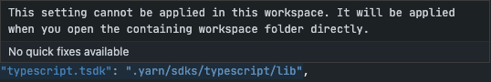

# [Yarn v2 : Yarn berry](https://github.com/yarnpkg/berry)

지인과 웹 개발에 대한 스터디를 진행하면서 yarn berry라는 것을 알게 되었다. [토스 피드의 글](https://toss.tech/article/node-modules-and-yarn-berry)을 통해 yarn berry가 내가 개발을 하며 겪던 불편한 점들을 꽤 많이 해소해준다는 것을 알게 되었다.

요즘 Next.js에 관심이 많았고, 회사에서도 Next.js를 기반으로 한 프로젝트를 진행중이었기 때문에 Next.js에서 yarn berry를 적용하기 위해서는 어떻게 해야하는지 알아보고 연습삼아 적용해보기로 했다.

> [GitHub 레포지토리를 만들어서 연습을 해보았다.](https://github.com/WDever/yarn-berry-next-js)

# **새로운 Next.js 앱에 yarn berry 적용**

새로운 Next.js 프로젝트에 yarn berry를 적용하려면 `create-next-app` 을 통해 Next.js 앱을 구성하기 보다는 직접 구성하는게 더 편하다.

**[yarn berry installation](https://yarnpkg.com/getting-started/install) | [Next.js Manual Setup 문서](https://nextjs.org/docs/getting-started#manual-setup)**

## yarn berry로 프로젝트 구성

우선 **[yarn berry installation](https://yarnpkg.com/getting-started/install)** 문서를 참고하여 yarn berry로 프로젝트를 구성한다.

## Next.js 직접 적용

yarn berry로 구성된 프로젝트에 직접 Next.js를 적용해주면 된다. **[Next.js Manual Setup 문서](https://nextjs.org/docs/getting-started#manual-setup).**

## 실습

나의 경우에는 터미널을 이용해 다음과 같은 과정으로 실습 해보았다.

1. `corepack enable`

   [yarn 공식 문서](https://yarnpkg.com/getting-started/install#install-corepack)에서 추천하는 yarn을 관리하는 방법이다. 내가 사용하는 Node.js 버전은 보통 16.13.0 이상이기 때문에 위 커맨드를 사용했다.

2. `mkdir [project-name]` and `cd [project-name]`
3. `yarn init -2`
4. `yarn add next react react-dom`
5. pakage.json 에 아래 내용 추가

   ```json
   "scripts": {
     "dev": "next dev",
     "build": "next build",
     "start": "next start",
     "lint": "next lint"
   }
   ```

6. `mkdir pages && touch pages/index.tsx` 혹은 `mkdir src && mkdir src/pages && touch pages/index.tsx`
7. 위의 index.tsx 파일 내에

   ```jsx
   function HomePage() {
     return <div>Welcome to Next.js!</div>;
   }

   export default HomePage;
   ```

   내용 추가

8. `yarn dev`

이대로 진행하면 Zero-install 기능을 포함하여 yarn berry를 사용할 수 있다.

직접 프로젝트를 구성하는 방법을 알고만 있다면 이미 개발이 진행중인 Next.js 앱에 적용하는 것보다 쉽다고 느껴진다. 아쉬운 점은 Next.js는 상당히 많은 example을 제공하는데 이런 것들을 활용하려면 직접 구성하는 방법으로는 어렵다. Next.js가 제공하는 example들을 활용하려면 다음의 **기존 Next.js 프로젝트에 yarn berry 적용** 방법을 따라야 한다.

# **기존 Next.js 프로젝트에 yarn berry 적용**

사실 [yarn berry의 공식 Migration 문서](https://yarnpkg.com/getting-started/migration)를 그대로 잘 따라하기만 해도 위와 같이 Zero-install 기능을 포함하여 yarn berry를 적용할 수 있다.

## 실습

나는 다음과 같이 적용했다.

1. `yarn set version berry` 를 통해 yarn berry 로 전환
2. `.yarnrc.yml` 파일에 `[nodeLinker: node-modules](https://yarnpkg.com/configuration/yarnrc#nodeLinker)` 추가

   `yarnrc` 혹은 `npmrc` 를 사용중이었다면 `yarnrc.yml` 로 마이그레이션 ([참고](https://yarnpkg.com/getting-started/migration#update-your-configuration-to-the-new-settings))

   > Yarnrc files (named this way because they must be called `.yarnrc.yml`) are the one place where you'll be able to configure Yarn's internal settings. While Yarn will automatically find them in the parent directories, they should usually be kept at the root of your project (often your repository). **Starting from the v2, they must be written in valid Yaml and have the right extension** (simply calling your file `.yarnrc` won't do).

3. `yarn install`
4. `.yarnrc.yml` 파일에 `[nodeLinker: node-modules](https://yarnpkg.com/configuration/yarnrc#nodeLinker)` 제거
5. `yarn install`
6. 아래 내용을 `.gitignore` 에 추가

   ```yaml
   .yarn/*!.yarn/cache
   !.yarn/patches
   !.yarn/plugins
   !.yarn/releases
   !.yarn/sdks
   !.yarn/versions
   ```

7. `node_modules` 삭제

# VSCode 설정

프로젝트에서 yarn berry를 사용하도록 설정한다고 끝나지는 않는다. VSCode와 함께 더 편리하게 개발하기 위해서는 추가로 해줘야 할 작업들이 있다.

[Editor Setup 문서](https://yarnpkg.com/getting-started/migration#editor-support)

1. [ZipFS](https://marketplace.visualstudio.com/items?itemName=arcanis.vscode-zipfs) 확장 설치
2. `yarn dlx @yarnpkg/sdks vscode` 실행
3. TypeScript를 사용한다면 워크스페이스의 TypeScript 버전을 사용하도록 설정하여야 한다.

   우측 하단에서 어떤 TypeScript 버전을 사용할 지 설정할 수 있는데 TypeScript의 경로를 확인하고 설정해주면 된다. `.yarn` 폴더의 TypeScript를 사용하면 된다.

   

---

위의 모든 과정을 마친다면 yarn berry를 Next.js 앱에서 사용하면서 기존과 같은 에디터 경험을 유지할 수 있다. 유의할 점은 TypeScript 사용 시 워크스페이스의 TypeScript 버전을 사용해야 하므로 VSCode의 Workspace 기능을 통해 여러 프로젝트를 관리하고 있었다면, 따로 관리할 수 밖에 없다.



# 직접 느낀 Yarn Berry의 장단점

[토스 피드의 글](https://toss.tech/article/node-modules-and-yarn-berry) 을 기반으로 내가 실제로 경험한 yarn berry가 해결해준 것들은:

1. **비효율적인 설치**

   모듈을 추가로 설치하거나, `node_modules` 를 모두 삭제한 후 다시 설치할 때 정말 오래걸리던 것이 체감이 가능할 정도로 빨라졌다.

2. **유령 의존성 (Phantom Dependency)**

   개발을 하다보면 내가 설치하지 않은 라이브러리들이 자동으로 import 되면서 ESLint가 `package.json` 에 있는 모듈만 사용하라고 경고하는데, 이런 경우가 사라졌다.

3. 빨라진 배포

   이건 1과 연관이 있는데, 배포를 하는 과정에서 `yarn install` 의 실행 시간이 단축되다보니 배포 시간이 꽤나 빨라졌다. 회사의 배포환경에서는 대략 2분 정도의 차이가 났다.

개인적으로는 아직 단점을 느끼지 못했다. yarn berry를 적용한 프로젝트는 아직 혼자 개발하고 있고, 지원하지 않는 모듈도 아직까지 없었다. 하지만 [JBee님의 회고](https://jbee.io/web/from-2021-to-2022/)를 보면 생태계가 yarn berry를 반기지 않는 것 같다고 한다. 나보다 훨씬 오랜 기간 사용하셨으니 더 정확할 것이다.
