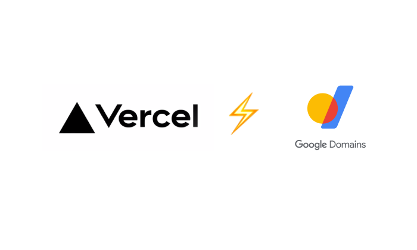
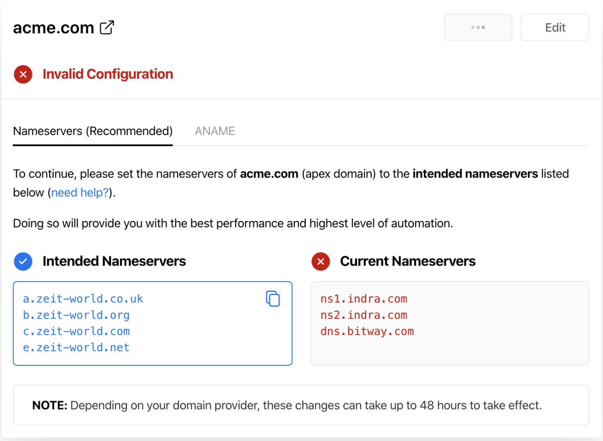
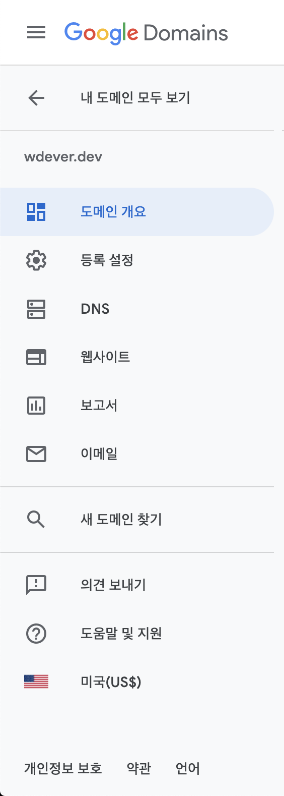
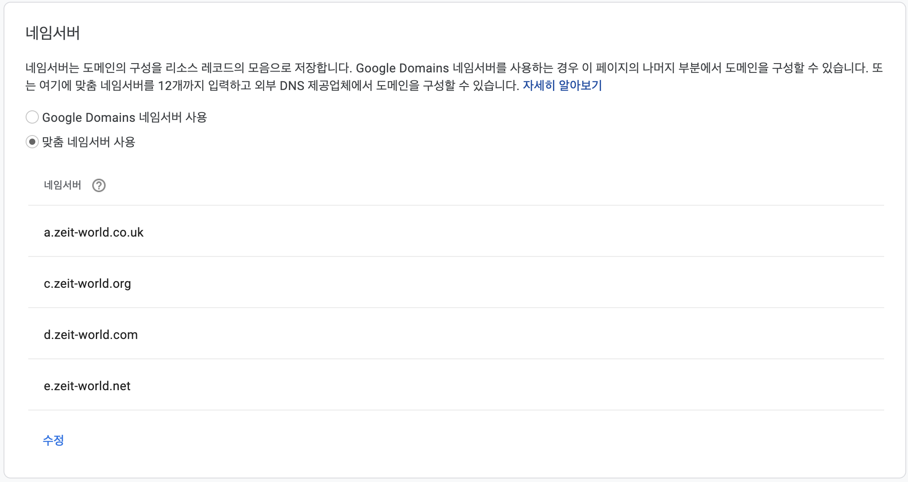
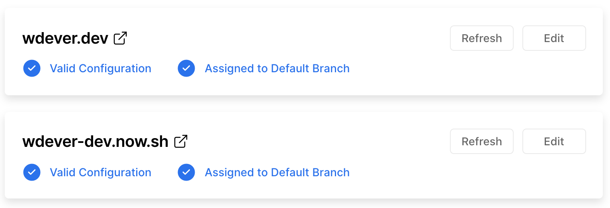

# 평생 배포라곤 안해본 프론트엔드 개발자의 커스텀 도메인 설정

전 지금까지 개발 하면서 배포는 이 블로그 딱 한번이 끝입니다. 팀 프로젝트를 할 때는 백엔드 팀이 배포를 해줬고, 개인 프로젝트 중 배포 한 프로젝트는 이 블로그가 처음이니까요. 저처럼 배포 초보자들이 보고 조금이나마 도움이 될 수 있는 글을 작성해봅니다.

## 너무나 자료가 적은 두 서비스

[Vercel](https://vercel.com/home)은 Netlify에 밀리는 듯 하고, [구글 도메인](https://domains.google/)은 그냥 자료가 별로 없어보였다. 평소 구글을 좋아하는 터라 무턱대고 구글 도메인에서 `.dev`를 구매했고, 이걸 적용 해야 하는데 어찌 하는지 몰라서 해멨다. 혹시 나처럼 해메는 사람들이 이 글을 보고 조금이나마 갈피를 잡길 바란다.

### Vercel 설정

Vercel은 [커스텀 도메인 설정 문서](https://vercel.com/docs/v2/custom-domains)를 제공해준다. 이걸 보고 따라하려 했으나 설정이 필요하다는 메일만 오고 뭘 해야하는지 몰랐다.

결국 다른 배포 서비스의 커스텀 도메인 설정 방법을 보고 따라해봤다.

우선 저 문서를 보고 따라해 도메인을 추가하는 것 까지는 쉬웠는데, 그 이후 설정을 어떻게 하는지 몰랐다. 사실 Vercel에서는 이게 다고, 이제 도메인 제공 서비스에서 설정 해야한다. 그 전에, 사진의 좌측에 있는 네임서버를 째려봐주자.

## 구글 도메인 설정

구글 도메인에서 도메인을 구매하면 해당 도메인의 대쉬보드로 이동된다.

좌측의 메뉴중 DNS로 이동한다.

그러면 사진과 같은 네임서버 설정을 볼 수 있다. Google Domain의 네임서버를 사용하면 여러가지 기능을 사용할 수 있는듯 하지만 맞춤 네임서버를 사용해야 한다.

사진처럼 맞춤 네임서버로 설정해주고, 아까 째려봤던 Vercel이 제공하는 네임서버를 추가해주면 설정은 완료된다.

## 기다리기

설정 후 알림에서는 배포한지 오래 됐다면 시간이 걸릴 수 있다는 내용이 있었던 걸로 기억한다. 하지만 난 배포한 후 바로 설정해서 바로 적용이 되었다. 보통 10~20분 정도 걸린다 하니 인내심을 가지고 기다려보자.

Vercel에서 다음과 같이 설정이 완료되었다고 하면 이제 해당 도메인을 이용할 수 있다.

